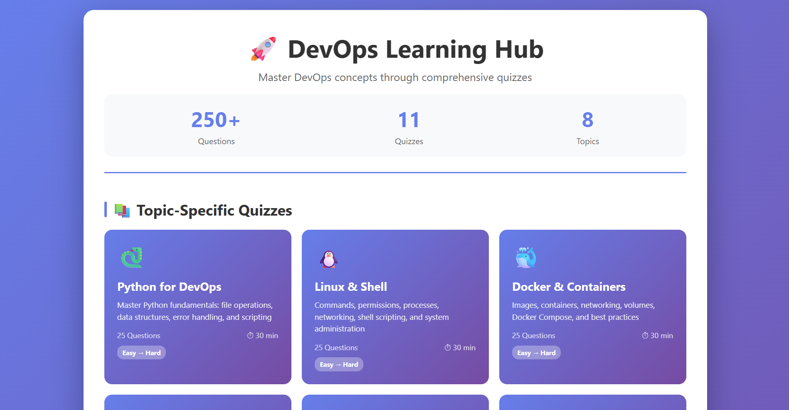
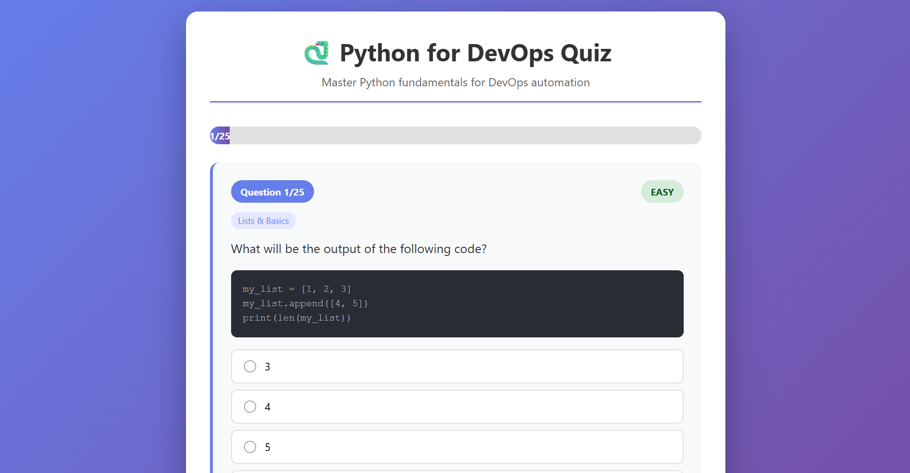
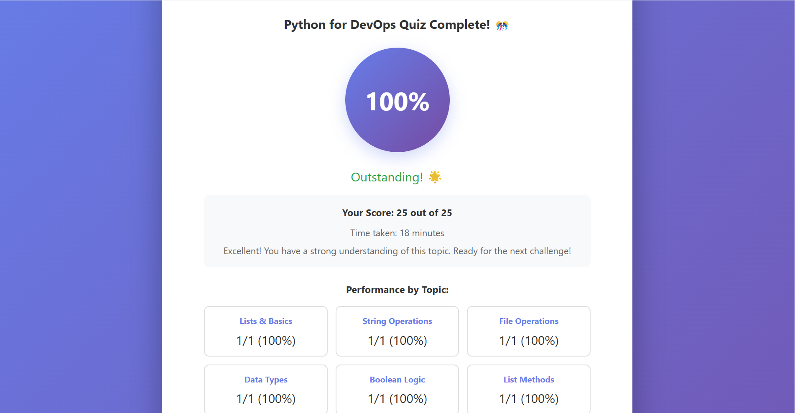

# 🚀 DevOps Learning Hub

> A comprehensive, interactive quiz system for mastering DevOps fundamentals

[](https://github.com/yourusername/devops-learning-hub)
[](https://github.com/yourusername/devops-learning-hub)
[](LICENSE)

---

## 📚 What's This?

An interactive learning platform with **280+ interview-ready questions** covering:

- 🐍 **Python for DevOps** (25 questions)
- 🐧 **Linux & Shell** (25 questions)  
- 🐳 **Docker & Containers** (25 questions)
- ☸️ **Kubernetes** (25 questions)
- 🔄 **CI/CD** (25 questions)
- ☁️ **AWS** (25 questions)
- 🏗️ **Infrastructure as Code** (25 questions)
- 📊 **Monitoring & Observability** (25 questions)
- 🎓 **Junior Final Exam** (30 mixed questions)
- 🎖️ **Intermediate Final Exam** (35 mixed questions)
- 🏆 **Advanced Final Exam** (40 real-world scenarios)

---

## ✨ Features

✅ **Interactive quizzes** with instant feedback  
✅ **Detailed explanations** for every answer  
✅ **Pro tips** from experienced DevOps engineers  
✅ **Progress tracking** by topic and difficulty  
✅ **Zero setup** - runs in browser, no backend needed  
✅ **Fully offline** - works without internet  
✅ **Mobile-friendly** - responsive design  

---

## 🎯 Quick Start

### Option 1: Use Online (Recommended)

**👉 [Launch Live Demo](https://lirchen.github.io/devops-learning-hub/)**

### Option 2: Run Locally

```bash
# Clone the repository
git clone https://github.com/lirchen/devops-learning-hub.git

# Navigate to the folder
cd devops-learning-hub

# Open index.html in your browser
# On Mac:
open index.html

# On Linux:
xdg-open index.html

# On Windows:
start index.html
```

**That's it! No installation, no dependencies!**

---

## 📖 Documentation

| File | Description |
|------|-------------|
| [START_HERE.md](START_HERE.md) | 30-second quick start guide |
| [COMPLETE_SUMMARY.md](COMPLETE_SUMMARY.md) | Comprehensive overview |
| [SAMPLE_QUESTIONS.md](SAMPLE_QUESTIONS.md) | Templates for creating more quizzes |
| [FILE_LIST.txt](FILE_LIST.txt) | Complete file inventory |

---

## 🎓 Recommended Study Plan

### Junior Level (Weeks 1-2)
```
Week 1: Core Skills
  Day 1: Python Quiz (30 min)
  Day 2: Linux Quiz (30 min)
  Day 3: Docker Quiz (30 min)
  Day 4-5: Review weak areas
  Weekend: Junior Final Exam (45 min)

Week 2: Review & Practice
  Retake quizzes, aim for 90%+
```

### Intermediate Level (Weeks 3-4)
```
Week 3: Advanced Topics
  Day 1: Kubernetes Quiz (45 min)
  Day 2: CI/CD Quiz (45 min)
  Day 3: AWS Quiz (45 min)
  Day 4: Review weak areas
  Day 5: IaC Quiz (45 min)
  Weekend: Monitoring Quiz (30 min)

Week 4: Mastery
  Intermediate Final Exam (60 min)
```

### Advanced Level (Week 5+)
```
Week 5: Real-World Scenarios
  Advanced Final Exam (90 min)
  Focus on troubleshooting and problem-solving
  Practice explaining your reasoning

Goal: 85%+ on advanced exam = interview-ready!
```

---

## 📊 What You'll Learn

### Python for DevOps
- Lists, dictionaries, file operations
- JSON handling and data parsing
- Error handling and best practices
- Automation scripting fundamentals

### Linux & Shell
- Essential commands and utilities
- File permissions and process management
- Pipes, grep, and text processing
- Shell scripting basics

### Docker & Containers
- Images vs containers
- Dockerfile best practices
- Volumes and networking
- Multi-stage builds and optimization

### Kubernetes
- Pods, Deployments, Services
- ConfigMaps, Secrets, Volumes
- Networking and Ingress
- RBAC, Health Checks, Scaling

### CI/CD
- Pipeline design patterns
- Jenkins, GitLab CI, GitHub Actions
- Deployment strategies (blue-green, canary)
- Artifact management and security

### AWS
- EC2, S3, VPC, IAM fundamentals
- RDS, Lambda, CloudWatch
- High availability and disaster recovery
- Cost optimization strategies

### Infrastructure as Code
- Terraform: state, modules, workspaces
- Ansible: playbooks, roles, inventory
- GitOps workflows
- Best practices and testing

### Monitoring & Observability
- Prometheus and Grafana
- Metrics, logging, tracing
- SLOs and error budgets
- Alerting best practices

### Final Exams
- Junior: Mixed fundamentals
- Intermediate: Cross-topic integration
- Advanced: Real-world problem solving

---

## 🛠️ Tech Stack

- **Frontend:** Pure HTML, CSS, JavaScript
- **No backend required** - fully client-side
- **No build tools** - just open and run
- **No dependencies** - everything included

---

## 📁 Project Structure

```
devops-learning-hub/
├── index.html                      # Landing page
├── devops_hub.html                 # Main quiz menu
├── quiz_template.js                # Reusable quiz engine
│
├── quiz_python.html                # Python quiz UI
├── python_questions.js             # Python questions (25)
│
├── quiz_linux.html                 # Linux quiz UI
├── linux_questions.js              # Linux questions (25)
│
├── quiz_docker.html                # Docker quiz UI
├── docker_questions.js             # Docker questions (25)
│
├── quiz_kubernetes.html            # Kubernetes quiz UI
├── kubernetes_questions.js         # Kubernetes questions (25)
│
├── quiz_cicd.html                  # CI/CD quiz UI
├── cicd_questions.js               # CI/CD questions (25)
│
├── quiz_aws.html                   # AWS quiz UI
├── aws_questions.js                # AWS questions (25)
│
├── quiz_iac.html                   # IaC quiz UI
├── iac_questions.js                # IaC questions (25)
│
├── quiz_monitoring.html            # Monitoring quiz UI
├── monitoring_questions.js         # Monitoring questions (25)
│
├── final_exam_junior.html          # Junior exam UI
├── final_junior_questions.js       # Junior exam (30)
│
├── final_exam_intermediate.html    # Intermediate exam UI
├── final_intermediate_questions.js # Intermediate exam (35)
│
├── final_exam_advanced.html        # Advanced exam UI
├── final_advanced_questions.js     # Advanced exam (40)
│
└── docs/
    ├── README.md                   # This file
    ├── START_HERE.md               # Quick start
    ├── COMPLETE_SUMMARY.md         # Full documentation
    └── SAMPLE_QUESTIONS.md         # Question templates
```

---

## 🎨 Screenshots

### Main Hub


### Quiz Interface


### Results


---

## 🤝 Contributing

Want to add more questions? Here's how:

1. **Fork** this repository
2. **Create** a new question file (see [SAMPLE_QUESTIONS.md](SAMPLE_QUESTIONS.md) for templates)
3. **Follow** the question format in existing `*_questions.js` files
4. **Test** your quiz locally
5. **Submit** a pull request

### Question Format

```javascript
{
    difficulty: "easy", // "easy", "medium", or "hard"
    topic: "Topic Name",
    question: "Your question here?",
    code: "// Optional code block", // Optional
    options: ["Option A", "Option B", "Option C", "Option D"],
    correct: 1, // Index of correct answer (0-3)
    explanation: "Detailed explanation here.",
    tip: "Pro tip for practical application" // Optional
}
```

---

## 📈 Roadmap

- [x] Python Quiz (25 questions)
- [x] Linux Quiz (25 questions)
- [x] Docker Quiz (25 questions)
- [x] Junior Final Exam (30 questions)
- [x] Kubernetes Quiz (25 questions)
- [x] CI/CD Quiz (25 questions)
- [x] AWS Quiz (25 questions)
- [x] IaC Quiz (25 questions)
- [x] Monitoring Quiz (25 questions)
- [x] Intermediate Final Exam (35 questions)
- [x] Advanced Final Exam (40 questions)

**✨ All quizzes complete! Ready to use!**

---

## 🎯 Use Cases

- 📚 **Self-study** for DevOps interviews
- 🎓 **Bootcamp curriculum** for training programs
- 💼 **Team training** for upskilling engineers
- 📊 **Technical assessments** for hiring
- 🏆 **Skill validation** for junior DevOps roles

---

## 🌟 Why This Project?

I created this after preparing for DevOps interviews and realizing:
- Most resources are scattered across multiple sites
- Theory without practice doesn't stick
- Explanations matter more than just answers
- Interactive learning is more engaging

This system combines everything in one place with:
- Real interview questions
- Detailed explanations
- Practical tips from experience
- Zero barriers to entry

---

## 📝 License

MIT License - feel free to use, modify, and share!

---

## 💡 Tips for Success

1. **Don't just memorize** - understand WHY each answer is correct
2. **Read ALL explanations** - even when you answer correctly
3. **Note the Pro Tips** - they're based on real experience
4. **Retake quizzes** - repetition solidifies learning
5. **Practice hands-on** - theory + practice = mastery

---

## 🆘 Support

- 📖 Read the [documentation](COMPLETE_SUMMARY.md)
- 💬 Open an [issue](https://github.com/lirchen/devops-learning-hub/issues)
- 🐛 Found a bug? Report it!
- ✨ Have a suggestion? Share it!

---

## 👏 Acknowledgments

- Inspired by the DevOps community
- Question formats influenced by HackerRank, LeetCode, and real interviews
- Built with ❤️ for DevOps learners everywhere

---

## 📊 Stats


---

<p align="center">
  <strong>Ready to ace your DevOps interview?</strong><br>
  <a href="https://lirchen.github.io/devops-learning-hub/">🚀 Start Learning Now</a>
</p>

---

<p align="center">
  Made with 💙 by <a href="https://github.com/lirchen">Lir Chen</a><br>
  Star ⭐ this repo if you found it helpful!
</p>
